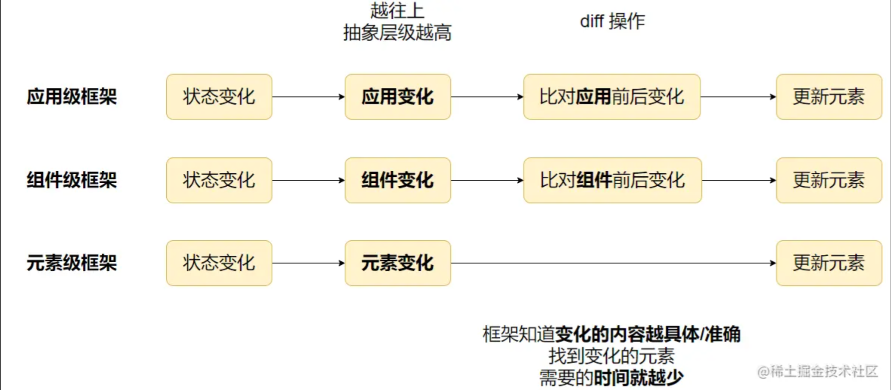

Vue3 中的 `v-memo` 是一种高效的**优化组件重渲染**的指令。它可以阻止组件元素在没有必要的情况下进行重新渲染，从而提高应用程序的性能。

在本文中，我们将对 `v-memo` 指令的使用方法、原因以及源码进行解释，通过对源码的分析，我们可以深入了解 v-memo 指令的作用以及如何在实际项目中使用它。

使用示例

```html
<template>
  <div v-memo="[valueA, valueB]">...</div>
</template>
```

**缓存一个模板的子树**。在元素和组件上都可以使用。为了实现缓存，该指令需要传入一个固定长度的依赖值数组进行比较。**如果数组里的每个值都与最后一次的渲染相同，那么整个子树的更新将被跳过**。

> 正确指定缓存数组很重要，**否则应该生效的更新可能被跳过**。`v-memo` 传入空依赖数组 (`v-memo="[]"`) 将与 `v-once` 效果相同。

**与 `v-for` 一起使用**

最常见的情况可能是有助于渲染海量 `v-for` 列表 (长度超过 1000 的情况)：

```html
<template>
  <div v-for="item in list" :key="item.id" v-memo="[item.id === selected]">
    <p>ID: {{ item.id }} - selected: {{ item.id === selected }}</p>
    <p>...more child nodes</p>
  </div>
</template>
```

假设上面是一个很大的数据量的列表，它会显示当前 `item` 是否被选中（单选）。

当组件的 `selected` 状态改变，默认会**重新创建大量的 vnode**，即使绝大部分都没有变化（selected 状态没有改变，仍然为 false）。Vue 会将这些新的 vnode 跟上一个状态的 **vnode 进行比对，找到它们的差异**，然后进行更新。

由于只有少部分差异，但由于 vnode 数量巨大，**会消耗非常多的性能用于查找差异**，这种场景下使用 `v-memo` 就非常的合适。

`v-memo` 用于**性能至上场景中的微小优化**

如何理解这句话？

- **性能至上**：系统追求较高的性能
- **微小变化**：状态改变，引起的变化是微小的，不是巨大的。

> 性能这个能理解，为什么得是微小变化呢？

因为如果是大量的状态变化的话，`v-memo` 的缓存其实是大量失效的，这时候的**性能提升效果就不会太明显**，还可能有 `v-memo` 的依赖设置错误导致更新被跳过的风险

# 为什么需要 v-memo

其实上一小节已经讲地差不多了：

因为 **Vue 组件状态改变引起组件重新渲染**，在大量元素的情况下，可能会**导致性能问题**，为了解决这些问题，`v-memo` **允许开发者明确告诉 Vue**，当依赖的内容没有变化时，不需要重新渲染该部分的内容。

不过其实我们可以想得更深一点。

我在[《浅谈前端框架原理》](https://juejin.cn/post/7194473892268736549 'https://juejin.cn/post/7194473892268736549')中对数据驱动的现代前端框架进行分类：

- 应用级框架，如 React
- 组件级框架，如 Vue
- 元素级框架，如 Svelte



**Vue 作为一个组件级框架**，当状态变化时，它只能知道该组件发生了变化，却**不知道具体是哪个元素发生了变化**，因此还需对比 VNode 前后的变化，**找到变化的元素，然后进行更新**。

正是由于组件级框架的这个特性，在组件包含大量元素的情况下，**大量的 VNode 比对会消耗大量的性能**，需要一种机制去**优化组件的重渲染**

对于**应用级框架**，当状态发生变化时，**框架只能知道应用发生了变化**，但不知道是哪个组件、哪个元素发生了变化，需要从根组件开始找出变化的部分。因此也会有这样的问题。

React 作为应用级框架，同样也存在类似的能力：[memo](https://link.juejin.cn?target=https%3A%2F%2Fbeta.reactjs.org%2Freference%2Freact%2Fmemo 'https://beta.reactjs.org/reference/react/memo')。

```jsx
import { memo, useState } from 'react';

export default function MyApp() {
  const [name, setName] = useState('');
  const [address, setAddress] = useState('');
  return (
    <>
      <label>
        Name{': '}
        <input value={name} onChange={(e) => setName(e.target.value)} />
      </label>
      <label>
        Address{': '}
        <input value={address} onChange={(e) => setAddress(e.target.value)} />
      </label>
      <Greeting name={name} />
    </>
  );
}

const Greeting = memo(function Greeting({ name }) {
  return (
    <h3>
      Hello{name && ', '}
      {name}!
    </h3>
  );
});
```

通过给 `memo` 函数传入组件函数，**实现对组件的缓存**，`memo` 函数默认会根据 `props` 前后是否变化，选择是否重新创建 VDOM。由于 React JSX 的开发模式，可以非常方便的拆分组件（相对于 Vue 单文件组件来说），通过拆分组件配合 `memo`，可以做到跟 `v-memo` 相同的效果。

> 值得注意的是，**Vue 由于有编译优化，在大部分情况下，Vue 是自带组件级别的 memo 能力**，如果子组件 props、slots 等没变，可以直接跳过该子组件的更新。因此 v-memo 常用在组件内的海量数据渲染中。

对于**元素级框架**，由于状态改变后，**框架能精准地定位到变化的元素**，然后进行更新，因此不会有以上的问题。

# 源码解析

我们直接到 `playground` 中看看 `v-memo` 编译后的样子：[在线示例](https://link.juejin.cn?target=https%3A%2F%2Fsfc.vuejs.org%2F%23eNplj71uwzAMhF%2BF5eIWqCVkNZQA3foGHcoOqUvHDqwfiHI6CHr3SkmRJRvvSH64y%2FgWgrpsjAMaGeMSEginLRzILTb4mCBD5AkKTNFb6OppR47c6J0ksHKCfds%2Fd%2B%2B8rh4%2BfFx%2FnroXckbfcBVURWIb1mPiqgDMvINLb9n6PeFnZXwRHnK%2B0koxet7dzx5so%2B8ofMVbxN4egzqLd7VEbp%2F0vxDCAa5O82r0pgnnlIIMWss0tupnUT6edJ1U3FxaLCsW239H%2FyscK5iwIQq5guUPOZhn5g%3D%3D 'https://sfc.vuejs.org/#eNplj71uwzAMhF+F5eIWqCVkNZQA3foGHcoOqUvHDqwfiHI6CHr3SkmRJRvvSH64y/gWgrpsjAMaGeMSEginLRzILTb4mCBD5AkKTNFb6OppR47c6J0ksHKCfds/d++8rh4+fFx/nroXckbfcBVURWIb1mPiqgDMvINLb9n6PeFnZXwRHnK+0koxet7dzx5so+8ofMVbxN4egzqLd7VEbp/0vxDCAa5O82r0pgnnlIIMWss0tupnUT6edJ1U3FxaLCsW239H/yscK5iwIQq5guUPOZhn5g==')

```html
<script setup>
  import { ref } from 'vue';

  const msg = ref('Hello World!');
</script>

<template>
  <h1 v-memo="[msg]">{{ msg }}</h1>
  <h1>{{ msg }}</h1>
</template>
```

其中 template 部分，有两个 `h1`，其中一个有 `v-memo`

编译后的代码如下：

```js
import {
  toDisplayString as _toDisplayString,
  createTextVNode as _createTextVNode,
  openBlock as _openBlock,
  createElementBlock as _createElementBlock,
  withMemo as _withMemo,
  createElementVNode as _createElementVNode,
  Fragment as _Fragment,
} from 'vue';

import { ref } from 'vue';

const __sfc__ = {
  __name: 'App',
  setup(__props) {
    const msg = ref('Hello World!');

    return (_ctx, _cache) => {
      return (
        _openBlock(),
        _createElementBlock(
          _Fragment,
          null,
          [
            _withMemo(
              [msg.value],
              () => (
                _openBlock(),
                _createElementBlock('h1', null, [
                  _createTextVNode(_toDisplayString(msg.value), 1 /* TEXT */),
                ])
              ),
              _cache,
              0
            ),
            _createElementVNode(
              'h1',
              null,
              _toDisplayString(msg.value),
              1 /* TEXT */
            ),
          ],
          64 /* STABLE_FRAGMENT */
        )
      );
    };
  },
};
__sfc__.__file = 'App.vue';
export default __sfc__;
```

我们直接关注两个 `h1` ，它们的主要区别是，`v-memo` 的 `h1` 会被包一层 `withMemo`

那我们直接看 `withMemo` 的源码：

```ts
export function withMemo(
  memo: any[],
  // 传入 render 函数
  render: () => VNode<any, any>,
  cache: any[],
  index: number
) {
  const cached = cache[index] as VNode | undefined;
  // 如果有缓存，且 memo 是相同的，就直接使用缓存
  if (cached && isMemoSame(cached, memo)) {
    return cached;
  }

  // 否则执行 render 函数，创建新的 VNode
  const ret = render();

  // shallow clone，浅复制
  ret.memo = memo.slice();
  // 返回 VNode，并记录到缓存
  return (cache[index] = ret);
}

// 判断 memo 是否相同
export function isMemoSame(cached: VNode, memo: any[]) {
  const prev: any[] = cached.memo!;
  if (prev.length != memo.length) {
    return false;
  }

  // 遍历检查每个依赖是否改变
  for (let i = 0; i < prev.length; i++) {
    // hasChanged 用 Object.is 判断
    // (value: any, oldValue: any): boolean => !Object.is(value, oldValue)
    if (hasChanged(prev[i], memo[i])) {
      return false;
    }
  }

  return true;
}
```

代码很简单，`v-memo` 其实就是判断 memo 的依赖是否改变，**没有改变则使用缓存的 VNode**，否则就调用 render 函数创建新的 VNode。

Vue 在对比 VNode 时，如果 **VNode 的引用没有变化，就会直接跳过该 VNode 的比对**，从而实现提高性能。

# 总结

总的来说，vue3 中的 `v-memo` 指令是一个非常有用的功能，可以有效地避免不必要的重新渲染，提高应用程序的性能。通过使用 `v-memo` 指令，开发人员可以更好地控制组件元素的更新和重新渲染，从而使应用程序更快，更流畅。